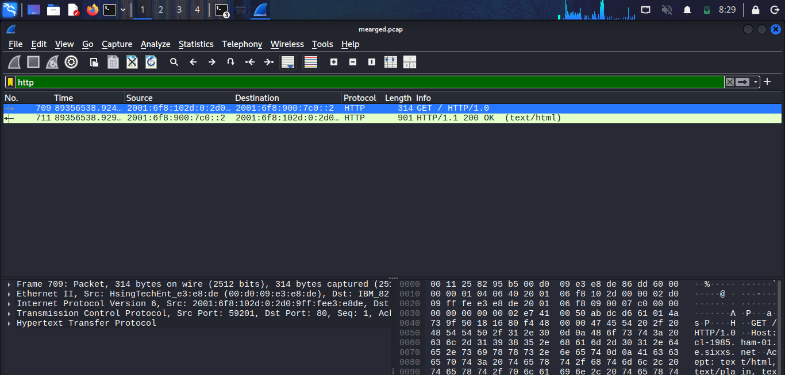
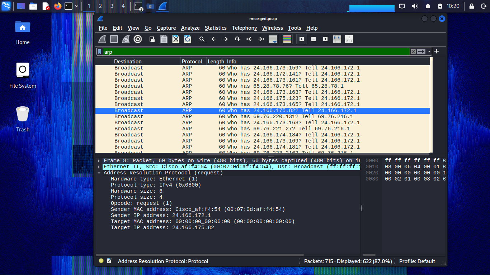
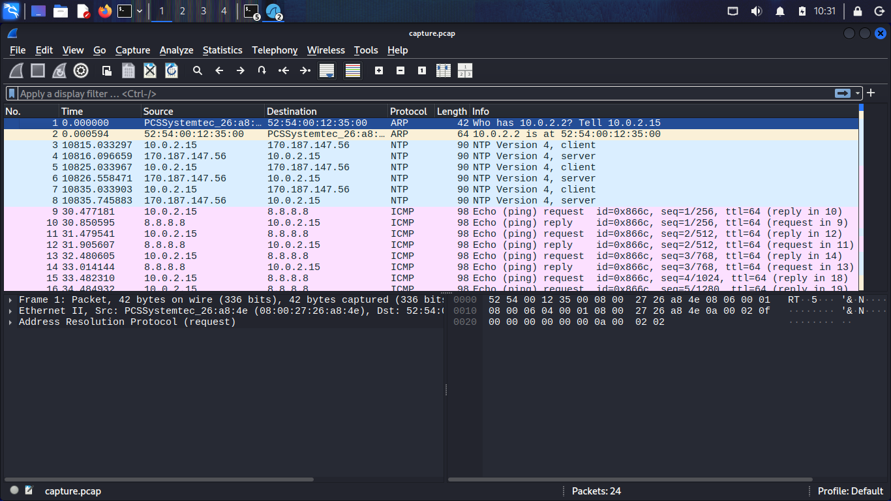

# Project 2.2 - Network Traffic Analysis with Wireshark
## Overview
This project captures and analyses HTTP, DNS, and ARP network traffic
using Wireshark and tcpdump on Kali Linux.
## Wireshark Installation
Installed Wireshark using sudo apt install wireshark -y
## HTTP Filter Applied

## HTTP GET Packet Inspected
Request Method: GET
Host: cl-1985.ham-01.de.sixxs.net\r\n
User-Agent: Lynx/2.8.6rel.2
Response Code: 200 OK

## ARP Packets Captured
Found ARP Request with broadcast ff:ff:ff:ff:ff:ff

## tcpdump Capture
Captured 24 packets using tcpdump on eth0

